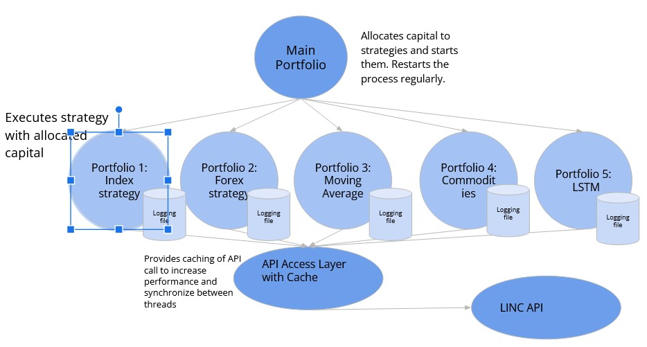

**LINC Hackathon 2024 Winning Team - Jannes Gata**

[Linkedin Post](https://www.linkedin.com/posts/simonmollegard_ended-last-work-week-at-lund-university-representing-activity-7167932958740361217-qtX7/?utm_source=share&utm_medium=member_desktop)

This is the code for our trading strategy for the LINC 2024 hackathon which we won. It was a trading competition held by Lund University Finance Society together with Nordea markets and SEB Fx. Data from 10 different asset classes was streamed over a period of time which you could trade on.

Our team name was 'Jannes Gata', which could be described as a swedish take on the trading firm Jane Street ;).

**Strategy**

 

The strategy utilizes multithreaded to distribute capital between different substrategies. These strategies use everything from a simple moving average to an LSTM. After the capital was distributed between the different models, they would trade for a while, the profit would be logged, and then the entire process would be restarted. Some nice things about this solution were: 

1. You can start simple. The python API was a bit tricky to work with, and took some time to conform to (some functions were available only after the start of the data streaming). With the approach of multiple strategies we could start with an index model (really just buying and holding the stock during its period) in order to make sure everything worked.
 
2. Strategies trade independently of each other. Utilizing multithreading, the strategies can trade concurrently with each other as long as they don't overspend and stay using their capital. This demanded some synchronization and making sure each strategy had sound code. We also used a caching layer to make sure not too many calls were made (the REST API also had a rate limiter).
 
3. Pivoting. As we got statistics of how each strategy regularly performed, we could see what was working or not. Using this, we could test out new strategies, and allocate a higher relative share of capital if they tended to perform better over time.
 
4. Risk aversion. While it is always fun with risk, this strategy is risk averse in the sense that it uses multiple independent models to trade with. Also in line with 3. if some model started to go ballistic we could simply remove it.

**Team members Github:**
[Jonatan Kruse](https://github.com/jonatan-kruse)
 
[Marcus Engdahl](https://github.com/MarcusEngdahl)
 
Anna Grimlund 
 
[Erik Lundberg](https://github.com/ErikLundb3rg)